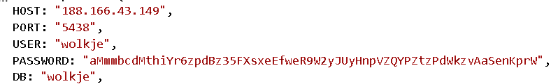
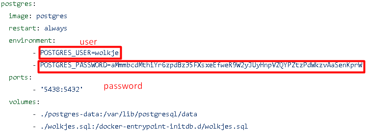

# backend

## download/clone

Download or clone the github project to a local directory, make sure the backend and the frontend are located in the same folder. Next open the project in an IDE of your choise, we used Visual Studio Code. Next you open a terminal in the root of the project.

## First start

We will first install all the required modules, in the terminal run:

```
npm install
```

## db.config.js

In the file `db.config.js` there are 2 variables you need to change. The host and the password and if you choose to change the user, you will also need to change the user.

</img>

The `HOST` is the IP of the server you normally just setup.

The `PASSWORD` is the password that you gave when you configured the postgres in the docker-compose.yml file.

And if you change the user of the database, you will have to set a `USER` too.
</img>

## MQTT start

In the root folder of the project there is a file named `MQTT.js`, in the file there is a line `const host = '188.166.43.149'`, you will need to change this host address. The IP you need to fill in, is the IP of the server where you deployed your docker compose file. If the server isn't running yet, i recommand you go do this right now.

## Run backend

To run the backend you go to the terminal and run:

```
node server.js
```

## Frontend

Clone the frontend from here: [https://github.com/Wolkjes/frontend] and follow the instructions in the README to start the frontend.

## server

Clone the server files from here: [https://github.com/Wolkjes/server] and follow the instructions in the README to run the docker-compose file.

## Add sensor

First update your sensor to the latest version: [https://github.com/Wolkjes/operame]

Then connect your sensor to the network and enter the correct IP-address:

<ol>
    <li>Turn the sensor on</li>
    <li>The sensor makes a wifi connection, connect to this with another device</li>
    <li>Then you will get a message to login on this wifi connection, open this and the configuration page will open in the browser</li>
    <li>Select the correct SSID of the password and enter the password of that SSID</li>
    <li>Enter the correct ip-address in the MQTT ip address box. This is the ip where you run all the server files (docker-compose file)</li>
    <li>Go to the bottom of the page and click on Save</li>
    <li>Then restart your sensor by clicking restart at the top of the page</li>
</ol>
